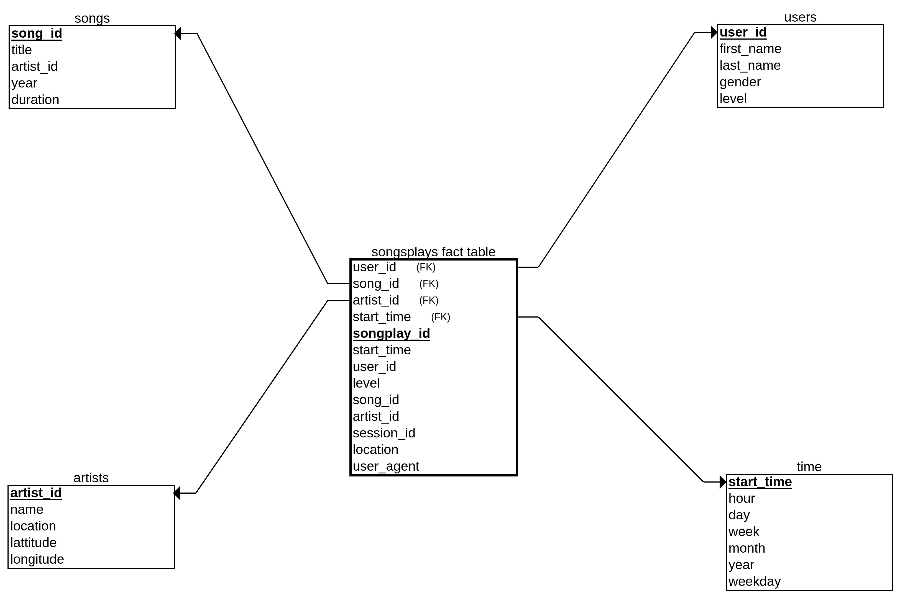

# Sparkify ETL
Sparkify is an online music streaming platform. They want to analyze the data they've been collecting on songs and user activity on their new music streaming app. The analytics team is particularly interested in understanding what songs users are listening to. Currently, they don't have an easy way to query their data, which resides in a directory of JSON logs on user activity on the app, as well as a directory with JSON metadata on the songs in their app.


## Datasets
1. Song Datasets - details and metadata about the song
```json
{"num_songs": 1, "artist_id": "AR36F9J1187FB406F1", "artist_latitude": 56.27609, "artist_longitude": 9.51695, "artist_location": "Denmark", "artist_name": "Bombay Rockers", "song_id": "SOBKWDJ12A8C13B2F3", "title": "Wild Rose (Back 2 Basics Mix)", "duration": 230.71302, "year": 0}
```
2. Log Datasets - User activity log
```json
{"artist":"Infected Mushroom","auth":"Logged In","firstName":"Jordan","gender":"F","itemInSession":3,"lastName":"Hicks","length":506.51383,"level":"free","location":"Salinas, CA","method":"PUT","page":"NextSong","registration":1540008898796.0,"sessionId":304,"song":"Deeply Disturbed","status":200,"ts":1541844653796,"userAgent":"\"Mozilla\/5.0 (Macintosh; Intel Mac OS X 10_9_4) AppleWebKit\/537.78.2 (KHTML, like Gecko) Version\/7.0.6 Safari\/537.78.2\"","userId":"37"}
```

## Database Schema for Song Play Analysis

The schema used for this project is the Star Schema: 
There is one main fact table containing all the measures associated to each event (user song plays), 
and 4 dimensional tables, each with a primary key that is being referenced from the fact table.




**Fact Table**
1. songplays - records in log data associated with song plays i.e. records with page NextSong

        - songplay_id, start_time, user_id, level, song_id, artist_id, session_id, location, user_agent


**Dimension Tables**
1. users - users in the app
    - user_id, first_name, last_name, gender, level
2. songs - songs in music database
    - song_id, title, artist_id, year, duration
3. artists - artists in music database
    - artist_id, name, location, latitude, longitude
4. time - timestamps of records in songplays broken down into specific units
    - start_time, hour, day, week, month, year, weekday


### ETL Pipleline
I have created an ETL pipeline which collects data from the json log files and then inserts them into respective tables. "etl.py" file consists of the complete pipeline.


#### Files Explained
There are 7 files in this project. 
1. data - This folder contains the log and song datasets.
2. etl.ipynb - experimentation notebook for ETL
3. test.ipynb - This jupyter notebook checks whether the written scripts for creating tables and inserting data are working fine or not.
4. create_tables.py - This program contains postgresql queries for creating the database and tables.
5. etl.py - This script contains the complete ETL pipeline for the project.
6. Readme.md - Documentation of the project.
7. sql_queries.py - sql queries

### How to run the project ?
```shell
python create_tables.py
python etl.py

```